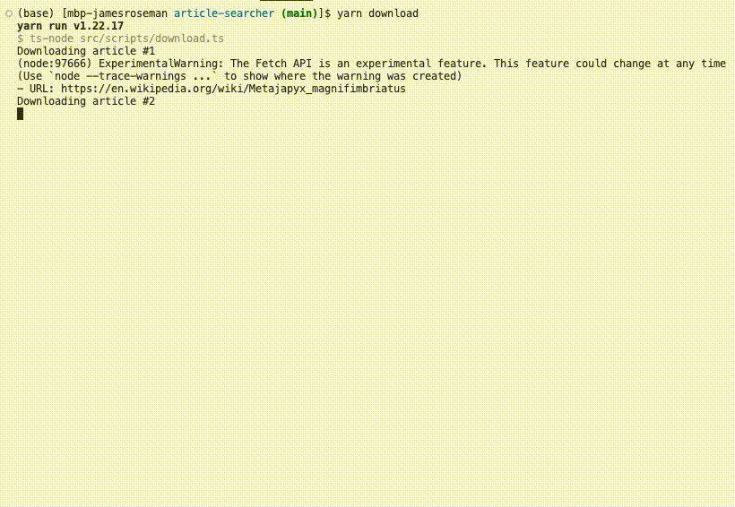
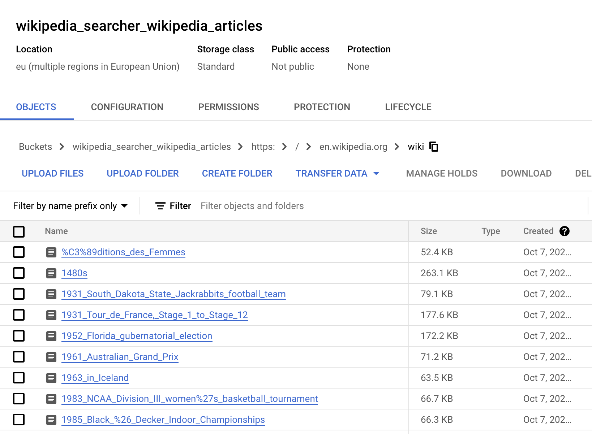
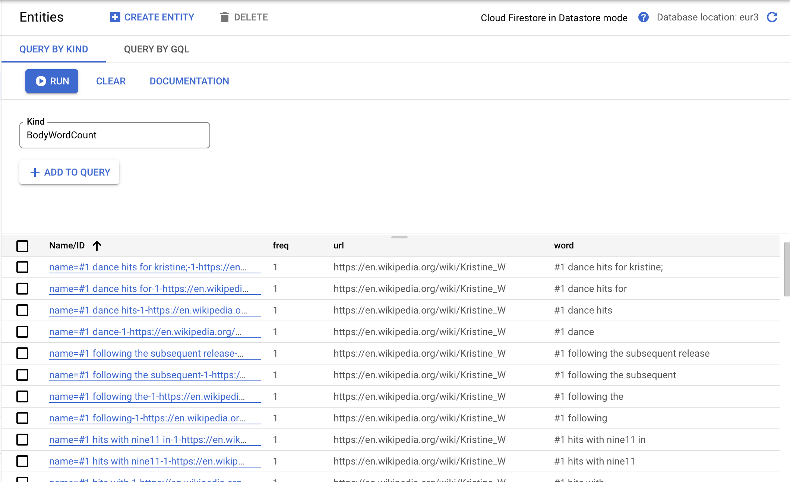
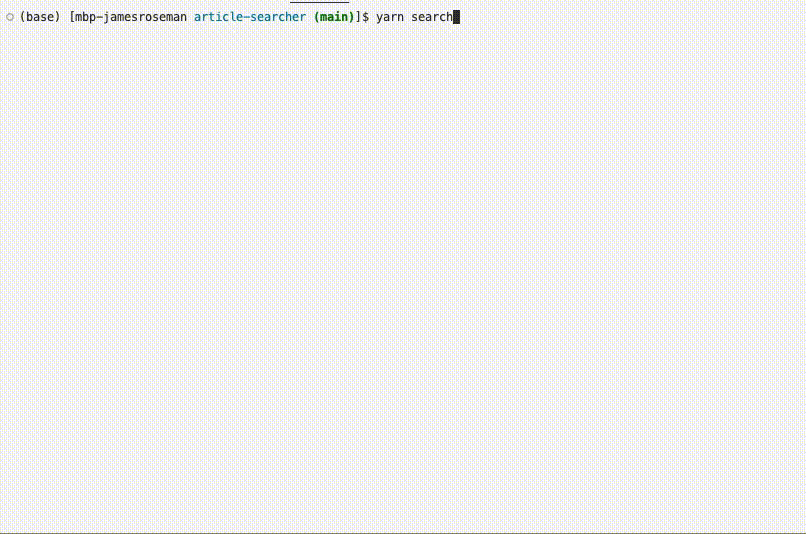

# Article Searcher

### Overview

This sample project provides interfaces needed to download and search articles scraped from Wikipedia. It leverages [a Wikipedia URL which takes you to a random article](https://en.wikipedia.org/wiki/Special:Random) to download articles at random.

This project is built in Typescript. It uses Google Cloud Storage for document storage, and Google Cloud Datastore for object storage and retrieval. 

#### Spec

Objective: Create a system which allows an end-user to:

1. Download up to 200 Wikipedia articles at random 

2. Search downloaded Wikipedia articles

#### Solution

I decicded to build standalone Typescript utility classes which could execute the above functionality. They can be found in `src/utils/`. They are listed, along with their function, below.

```
- ArticleDeleter.ts : An interface for deleting word-count representations of articles in Google Storage.

- ArticleDownloader.ts : An interface for downloading a random (or provided) Wikipedia article into Google Storage.

- ArticleFetcher.ts : An interface for fetching a random (or provided) Wikipedia article and parsing it into an HTMLElement object.

- ArticleFrequencyMap.ts : An interface for processing an article into a mapping of word frequencies (separated by words found in headings and body).

- ArticleProcessor.ts : An interface for processing stored articles in bulk, creating and storing their wrod frequency representations in Google Datastore as schemaless objects.

- ArticleSearcher.ts : An interface for searching all downloaded articles by relevance of the provided search term.

- SearchRelevanceScore.ts : An interface for creating a ranking of relevance, provided word frequency objects.

- WordFrequencyMap.ts : An interface for creating a word frequency mapping of some given text.
```

#### Methodology

After being downloaded, articles are processed and stored for efficient searching.

###### Word frequency maps

Articles are transformed into `ArticleFrequencyMap` objects by counting the frequency of words found in the article's heading and body. Words are scanned within a (configurable) 5-word window. For example, if an article included the sentence "Tim Berners-Lee devised and implemented the first Web browser", the frequency map representation would look as follows:

```
{
  "tim": 1, "tim berners-lee": 1, "tim berners-lee devised": 1, ...
  "berners-lee": 1, "berners-lee devised": 1, "berners-lee devised implemented": 1, ...
  ...
}
```

###### Storing word counts

Word counts are stored as individual objects in Datastore. The above example might be processed into many different word count objects, such as:

```
[
  { word: "tim", url: "...", freq: 1, isHeading: false },
  { word: "tim berners-lee", url: "...", freq: 1, isHeading: true }
  ...
]
```

###### Search term ordered permutation

Search terms are exploded into an ordered permutation of words. The search term "Shepard Fairey artist", for example, would be permuted into the following list of lists, where the index relates to how many words there are:

```
[
  [ "shepard", "fairey", "artist" ],
  [ "shepard fairey", "fairey artist"],
  [ "shepard fairey artist" ],
]
```

This makes it convenient to check for article relevance, as later terms are given higher weight. The frequency of `shepard fairey artist` in an article is given much higher weight than the frequency of `artist`.

###### Fetch word counts

Each search term in the ordered permutation is used to fetch word counts in the Datastore, if word counts exist. The order of the list (which relates to how many words are in each term) is respected.

```
[
  [ { word: "shepard", url: "...", freq: 23, isHeading: false }, ... ],
  [ { word: "shepard fairey", url: "...", freq: 1, isHeading: true }, ...]
]
```

###### Search relevance score

Finally, this list-of-lists is flattened by URL into a list of rankings for relevance. Search relevance score is computed by the following formula:

```
   headingModifier = 1000   (multiply frequency by 1000 if it's a heading)
   commonModifier  = 10     (multiply frequency by 10 for each word in the term, 
                             e.g. "shepard fairey" gets a multiplier of 20)
  
   score = headingModifier * commonModifier * frequency
```

This score was devised so that articles with search terms found in their headings are given higher relevance scores, as are articles in which multiple words from the search term are found. The search term "Tim Berners-Lee" should result in a higher relevance score for articles with "Tim Berners-Lee" or "Berners-Lee" in them than articles with "Tim" in them, even if the article has 100x more "Tim" mentions. 

A relevance score of less than 100 is found to be not relevant, so these are filtered out. Rankings are then sorted and returned.

### Performance

Each article is scanned a total of 5 times (in that the article is scanned via 5-word windows). These are then stored as individual objects. The time to process an article is linearly relational to the size of the article, so it can be said to be processed in `O(n)` time.

Search terms are exploded into ordered permutations. Depending on the search term, this might not be computationally negligible. However, lookups for these permutations can be thought of as constant time (in that the time of the lookup is not dependent on what's being looked up) and, because the word-searching has been done at the time of article processing, the relevance score computation can also be thought to be completed in constant time. It can be said that searching takes `O(m!)`, where `m` represents the number of words in the search term.

### Demo

#### Download articles

Articles are downloaded and processed via script: `npm run download`.

By default, 200 articles are downloaded. A cooldown of 3 seconds is applied between each download.



The articles downloaded by this script can be found in the configured bucket of your Google Cloud Storage.



The word counts for these articles can be found in the Datastore of your configured GCP project.



#### Search articles

Articles are searched via script: `npm run search "[SEARCH_TERM]"`.

By default, all articles with a relevance score above 100 are returned. 1-word search terms may not return results if the search term is "and", "if", "but", etc.



The search term "South Dakota American Football" returns the following results:

```
[
  {
    url: 'https://en.wikipedia.org/wiki/1931_South_Dakota_State_Jackrabbits_football_team',
    ranking: 90270
  },
  {
    url: 'https://en.wikipedia.org/wiki/North_Dakota_pottery',
    ranking: 20640
  },
  {
    url: 'https://en.wikipedia.org/wiki/South_Algonquin',
    ranking: 20120
  },
  {
    url: 'https://en.wikipedia.org/wiki/South_East_United_FC',
    ranking: 20100
  },
  {
    url: 'https://en.wikipedia.org/wiki/2018%E2%80%9319_Russian_Football_National_League',
    ranking: 20080
  },
  ...
]
```

As you can see, "South Dakota Jackrabbits football team" is by far the most relevant result, and the follow-ups seem accurate in terms of relevancy. "North Dakota pottery" includes "Dakota" in the title, which makes it marginally more relevant than "South Algonquin," which includes "South" in the title. "South East United FC" is relevant both because of the use of "South" in the title and frequent mentions of "football" in the article. "Russian Football National League" is relevant both because of the use "Football" in the title and the frequent mentions of "football" in the article.

### Future Steps

There were several things I want to do for this project in the future that I did not have time for.

#### Google Functions

The `download` script works by creating a blocking timer between each fetching call. A more production-friendly setup might utilize Google Functions for these downloads. Downloads would be processed as events and loaded into a queue (PubSub would be a great candidate for this). Download functions would be triggered by events, fetch/process the article, and then spin down. 

By downloading this way, you could parallelize the downloads and scale up to 400 simultaneous downloads, greatly reducing the amount of time it takes to download 200 articles.

This was in-scope for my original plan for this solution, but I ran out of time.

#### GraphQL API

The utility interfaces are siloed and could easily be wrapped in GraphQL API resolvers. This would allow article downloads and searches to be triggered by API calls.

#### React App

With a GraphQL API behind it, a React app would be trivial to set up. Search components could be filled by GraphQL queries trivially and then the articles could be displayed in-app. Similarly, downloads could be triggered by component interaction.

### How To Run

#### Install Dependencies

Install the necessary dependencies by running: 

`npm install`

*Note:* This project was built with `node v18.10.0` and `npm v8.19.2`. It may or may not work with earlier and later versions. I'd recommend using `nvm` to adjust `node` and `npm` versions as needed.

#### Configure Google Cloud Platform Account

You'll need a credentials JSON for a GCP user with admin access to Google Storage and Google Datastore. [You can follow this guide to create this credentials JSON.](https://developers.google.com/workspace/guides/create-credentials). 

The project expects the JSON in `credentials/credentials.json`, however this is configurable in the `.env` environment variable configuration file included in the project.

The project expects a project in your GCP account called `wikipediasearcher`. This should be changed to the name of the desired GCP project, and is also configurable in the `.env` environment variable configuration file included in the project.

The project expects a bucket in Google Storage called `wikipedia_searcher_wikipedia_articles`. This should be changed to the name of the desired bucket to store Wikipedia articles into, and is also configurable in the `.env` environment variable configuration file included in the project.